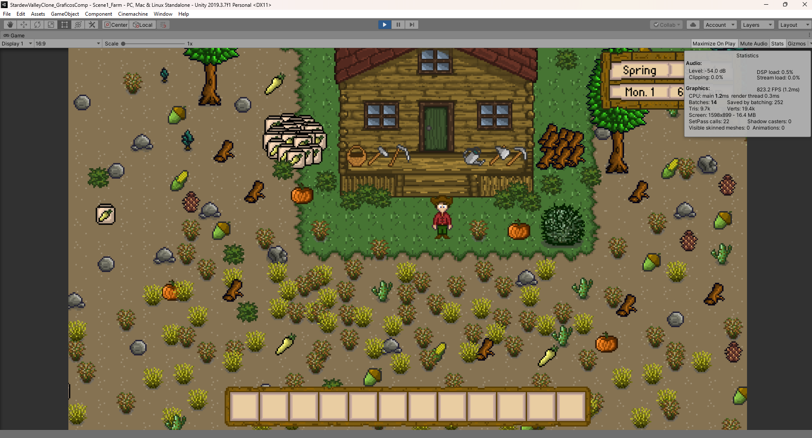
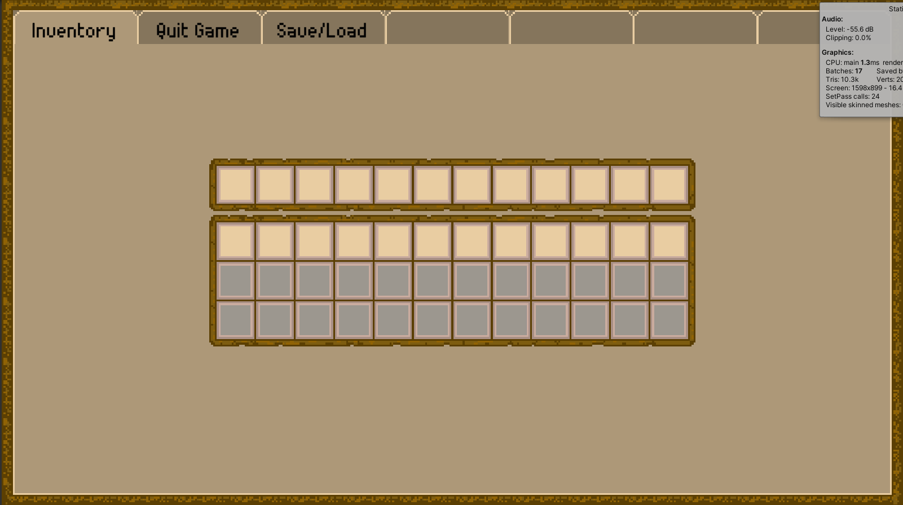
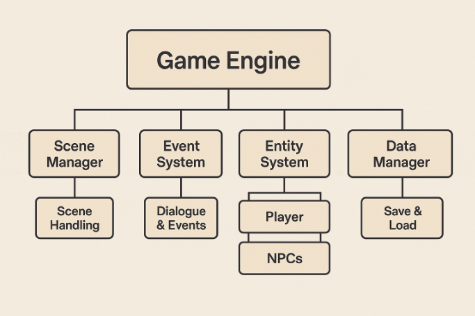

Resumen técnico del proyecto, vista general del mismo, para una comprensión mas detallada revisar la documentación pertinente a las secciones de [[Arquitectura]] y [[Especificaciones Técnicas]] del proyecto.

---

# 🌾 Clon de Stardew Valley en Unity

### _Documentación General del Proyecto_

---

## 🧑‍💻 Autores

*Cinthia Camila Bravo Marmolejo*  
*Andrés Torres Ceja*  
*Jose Angel Ramirez Martinez*

 **Fecha de inicio:** 2025-03-18  
 **Versión:** _alpha 0.1_

---

## 📜 Descripción General

###  _Resumen del Proyecto_

Este proyecto es un videojuego 2D inspirado en **Stardew Valley**, desarrollado con **Unity** y programado en **C#**. El enfoque principal es la **simulación de una granja** con mecánicas como:

- Gestión de cultivos 
    
- Cría de animales (Bajo Desarrollo) 
    
- Exploración de cuevas (Bajo Desarrollo) 
    
- Interacción con NPCs 
    
- Eventos dinámicos y ciclo día/noche 
    

El mundo será completamente abierto, inmersivo y con sistema de progresión.

> 📸 __

---

## 🧠 Algunos Algoritmos 2D Utilizados

```text
✔️ Z-buffering — Gestión de superposición de objetos  
✔️ Bresenham — Dibujo de líneas eficientes  
✔️ Dijkstra — Pathfinding para NPCs  
✔️ Viewports — Manejo de cámaras y desplazamientos  
✔️ Dithering — Mejora visual en paleta limitada  
✔️ Antialiasing — Suavizado de contornos  
✔️ Mipmapping — Optimización de texturas
✔️ A* - Para pathfinfing mejorado.
✔️ Culling - Para gestion del vieport y fading the elementos en pantalla.

```

---

## 🕹️ Mecánicas del Juego

###  Ciclo Día y Noche

Eventos y comportamientos que dependen del horario del juego.

###  Agricultura

Sistema completo de siembra, riego, cosecha y estacionalidad.

###  Cría de Animales

Animales con necesidades, cuidados y producción de recursos.

###  Economía y Comercio

Intercambio de productos con NPCs y mercado virtual.

###  Exploración & Combate

Cuevas, enemigos simples y tesoros ocultos.

###  Interacciones Sociales

NPCs con diálogos, regalos, eventos y relaciones crecientes.

###  Construcción

Mejora de la granja y creación de estructuras.

###  Interfaz de Usuario

Paneles intuitivos para inventario, misiones, relaciones, etc.

>  __

---

## 🛠️ Procedimientos Principales

|Sistema|Función|
|---|---|
| Gestor de Tiempo|Control del reloj y eventos programados|
| Entrada del Jugador|Captura de movimientos, acciones y navegación|
| Sistema de Tilemaps|Gestión del terreno, colisiones y mundo|
| Motor de Eventos|Manejo de diálogos, misiones y condiciones|
| IA para NPCs|Pathfinding, rutinas diarias y reacciones|
| Renderizado|Optimización de sprites y capas visuales|
| Guardado/Carga|Persistencia de datos y progreso del jugador|
| Animaciones|Control de sprites y transiciones|
| Sonido|Gestión de música y efectos|
| Interacciones|Acciones del jugador con el entorno y objetos|
| Inventario|Gestión de objetos, recursos y equipamiento|

---

## 🧩 Arquitectura del Programa

Estructura modular y orientada a componentes para facilitar la escalabilidad y mantenibilidad:

```text
📦 Motor Principal — Controla el ciclo global del juego  
🌍 Gestor de Escenas — Transiciones entre mapas  
🧱 Sistema de Entidades — Herencia y componentes de objetos del juego  
🗨️ Eventos y Diálogos — Motor para misiones e interacciones  
💾 Gestor de Datos — Guardado/carga de partidas
```

>  __

---

## 🧪 Especificaciones Técnicas

-  **Motor de Desarrollo:** Unity 2022 o superior
    
-  **Lenguaje:** C#
    
-  **Plataformas:** PC (potencialmente móvil en futuro)
    
-  **Estilo Visual:** Pixel Art escalable
    
-  **Animaciones:** Spritesheets con Unity Animator

-  **Sonido:** Efectos y música en formato WAV/OGG

-  **Gestión de Recursos:** Asset Bundles para optimización

-  **Control de Versiones:** GitHub para colaboración y seguimiento

-  **Documentación:** Markdown para claridad y accesibilidad

-  **Pruebas:** Unitarias y de integración para asegurar calidad

-  **Optimización:** Profiler de Unity para rendimiento

-  **Multiplataforma:** Exportación a Windows, Linux y potencialmente Android/iOS

-  **Licencia:** MIT para uso y modificación

    

---

## 🧑‍💻 Interfaz de Usuario (UI)

Elementos planeados para la experiencia del jugador:

|Componente|Descripción|
|---|---|
| Menú Principal|Inicio de partida, configuración y carga|
| HUD|Visualización de energía, tiempo, dinero|
| Panel de Objetos|Interacciones con entorno, personajes y menús secundarios|

---

## 🚶 Implementación del Movimiento

- Movimiento libre en mapa 2D alineado a tiles
    
- Física básica con `Rigidbody2D` y `Collider2D`
    
- Interpolación para suavidad en desplazamientos

- Animaciones de caminar y correr con `Animator`

- Sistema de entrada con `InputManager` para teclado y gamepad

- Colisiones con objetos y NPCs utilizando `Raycast` y `Trigger`

- Sistema de detección de colisiones con objetos y NPCs utilizando `Raycast` y `Trigger`

- Dibujado de lineas y entidades con algoritmo de **Bresenham** para detección de colisiones y caminos.

- Pathfinding con algoritmo **A*** para NPCs y enemigos.
    
---

## 🧱 Implementación de Tilemaps

- Grid basado en tiles de **16x16 px**
    
- Capas para terreno, objetos y decoraciones
    
- Colisiones por tipo de tile y entidad

- Uso de un viewport para gestionar la cámara y el área visible

- Sistema de culling para optimizar el renderizado

- Dithering para mejorar la paleta de colores y suavizar bordes

- Mipmapping para optimizar texturas y mejorar el rendimiento
    

---

## 🧬 Técnicas Avanzadas en C#

Para mantener el código limpio, escalable y eficiente:

```text
✔️ Programación orientada a objetos (POO)  
✔️ Eventos y delegados para comunicación flexible  
✔️ Patrones de diseño como Singleton y MVC  
✔️ Coroutines y Threads para procesos en segundo plano
✔️ Serializacion Binaria para conservacion de estado para escrituara de datos.
✔️ Multihilo para renderizado seccionado.
✔️ Interfaces de C# para diversos usos.
```

---

## 📌 Notas Finales

 Este proyecto se encuentra en etapa **alpha 0.1**, por lo tanto, varias mecánicas se encuentran en fase de diseño o prototipo.  
 Se planea expandir el proyecto con nuevas mecánicas, arte personalizado, compatibilidad multilenguaje y más.

## RoadMap:

>  En proceso de desarrollo, se planea implementar las siguientes características:
   - Mejora en la IA de los NPCs
   - Sistema de misiones más robusto
   - Soporte para múltiples idiomas
   - Optimización del rendimiento en dispositivos móviles
   - Crianza de animales
   - Sistema de comercio entre jugadores
   - Eventos dinámicos y misiones generadas proceduralmente
   - Sistema de Combate
   - Expansion del mapa y nuevas áreas para explorar
   - Estilo de juego tipo roguelike para cuevas

---

